# 👋 Hi, I'm Junfeng Chen

Welcome to my GitHub profile! I'm passionate about robotics and AI. I focus on **multi-robot system**, **robot planning**, and **robot learning**. Feel free to explore my repositories and contribute to open-source projects! Also you can transfers to our orgnization **[MRIL](https://github.com/TRIO-PKU)** to explore more !

---

## 🌱 Currently working on
- **Distributed Multi-robot task planning** algorithms in large-scale robots.  
    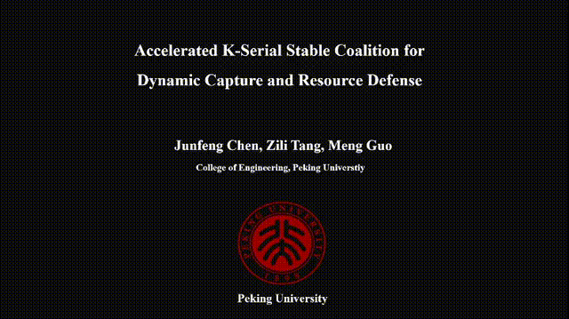

- **Hybrid optimization planning** algorithms in dynamic scenarios.  
    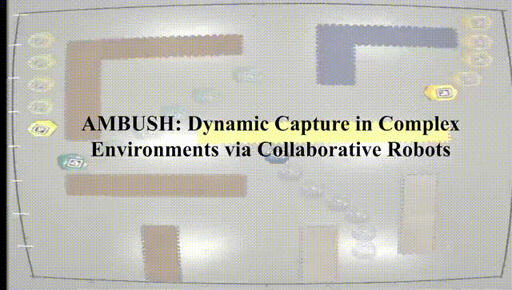

- **LLM enhanced task planning** algorithms in open and unknown environments.  
    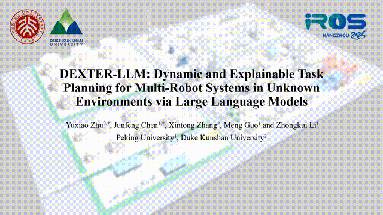
    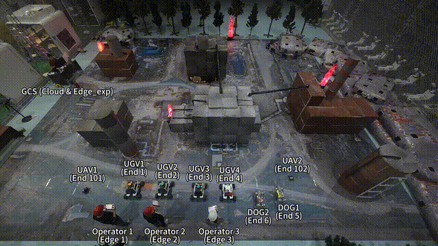

- **Intermitent communication based task planning** algorithms in communication-constrained scenarios.  
    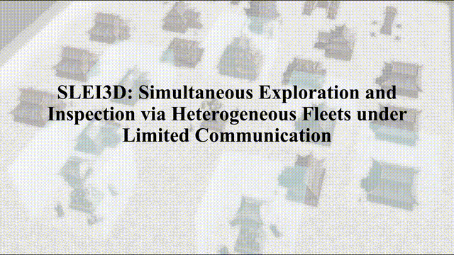
    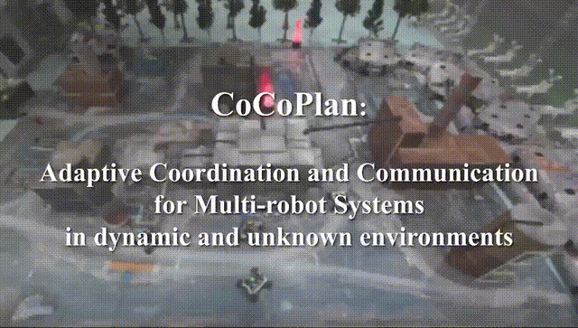

- **RL-based intelligent multi-robot system** 
 

- **Meta Learning in multi-robot system**
  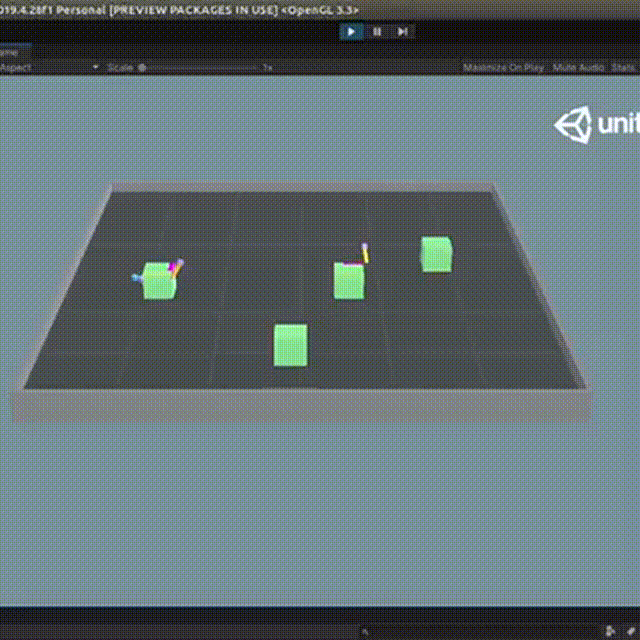

- **Robotics Simulator** design in the robotic community
  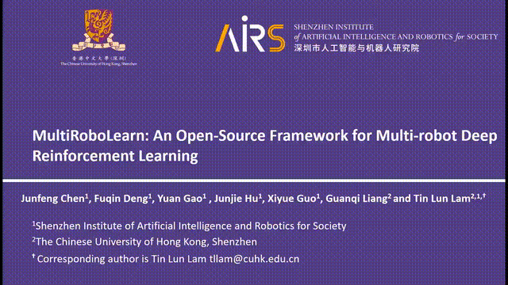  <!-- 检查文件是否存在，路径是否正确 -->
    
---

## 🛠️ Technologies & Tools
- 🐍 Python, C++, Matlab, C#
- 🤖 ROS (Robot Operating System)
- 🧠 Machine Learning (ML), RL, Graph learning
- 🔧 Git & GitHub
- 🎮 Robotics Simulator (Gazebo,issac gym, unity, mujuco, pybullet) and CATIA, AutoCAD
- 🚁 Robotic Platform  (Tello, crazyflies, quadrator, turtlebot, kkswarm, Scout, AgileX, Go2), heterogeneous multi-robot 
     system

---

## 📊 GitHub Stats

---

## 🤝 Collaboration & Contact

- 📫 Email: [chenjunfeng@stu.pku.edu.cn]
- 🌐 Personal Website: [your-website.com]
- 💬 Always open to academic collaboration, internships, and open-source contributions!

---

## ✨ Experimental Activity · Highlights

<b>🚀 Epic Moment: Large-scale Robot Catching in Action</b> 
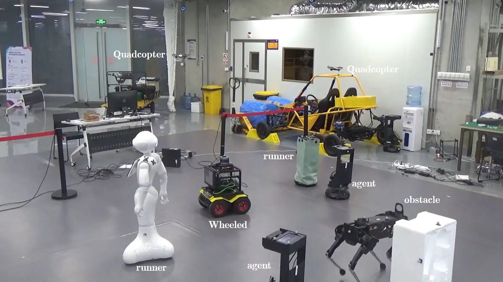
 
<i>Dozens of robots working in perfect harmony—this is the pinnacle of collective intelligence, captured in a single breathtaking moment.</i>
  

<b>🤖 Heterogeneous Robots: Each Shines in Their Own Way</b> 
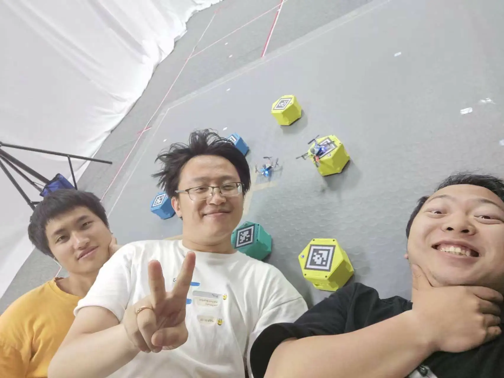
 
<i>Multiple types of robots, each with unique capabilities, collaborate seamlessly to showcase the beauty of diverse intelligent teamwork.</i>
  

<b>🧑‍💻 LLM Team: The Ultimate Group Photo</b> 
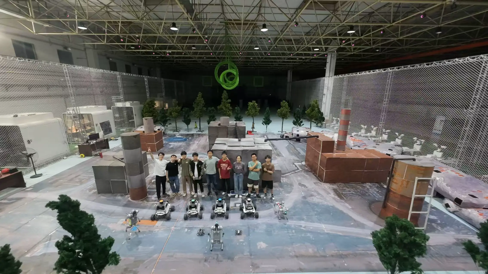
 
<i>Our team, united by passion and innovation—this photo captures the spirit of AI and human synergy at its finest.</i>
  

<b>🌈 CocoPlan: Behind the Scenes of the Release</b> 
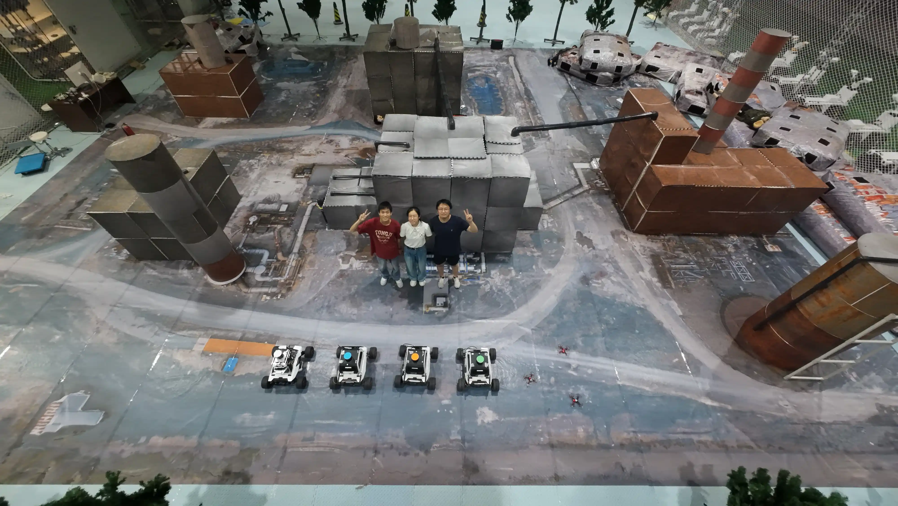
 
<i>Witness the creative spark and teamwork that power our cutting-edge algorithms—every breakthrough has a story.</i>
  

<b>🎨 SLEI3D: The Art of 3D Robot Collaboration</b> 
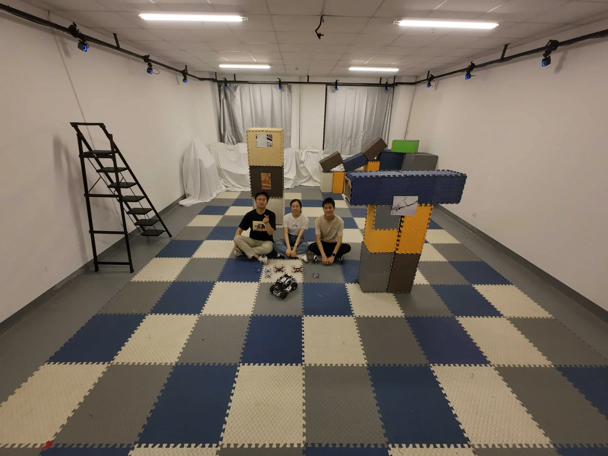
 
<i>Robots collaborating in 3D space—where technology meets aesthetics, and innovation becomes art.</i>
  

<b>🏆 Competition Highlight: The Ultimate Showdown</b> 
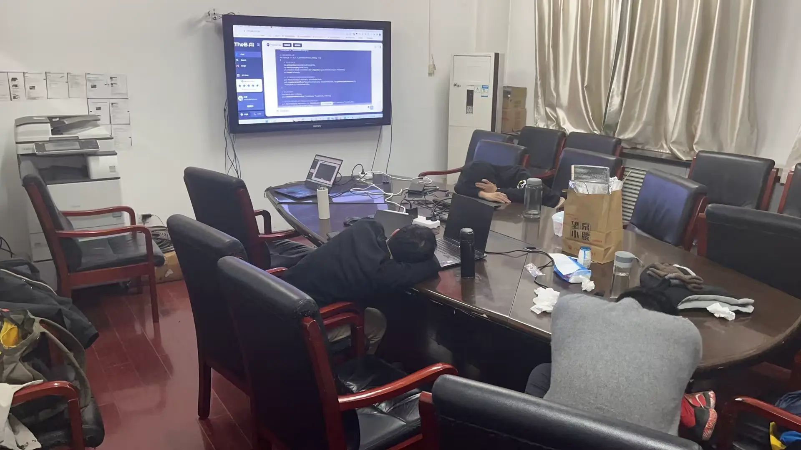
 
<i>Intense competition, rapid strategies, and the thrill of the challenge—this is where intelligent agents push their limits.</i>
  

<b>🌟 LLM Team Special Edition (JPG)</b> 
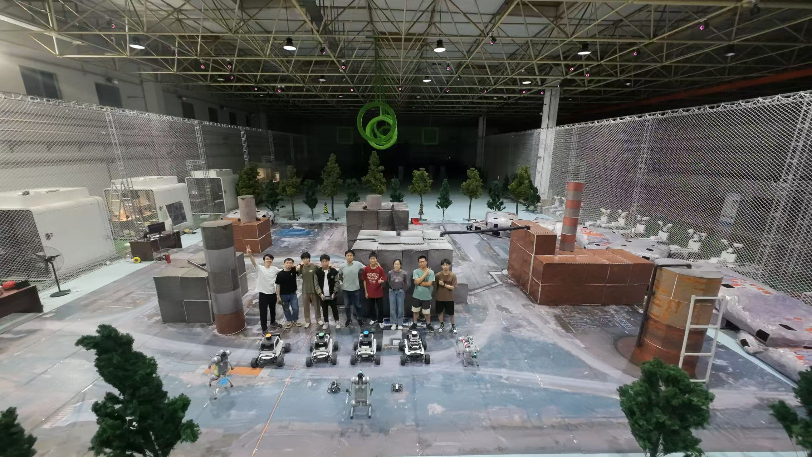
 
<i>A different perspective on our team—cherished memories and moments worth revisiting.</i>
 

  